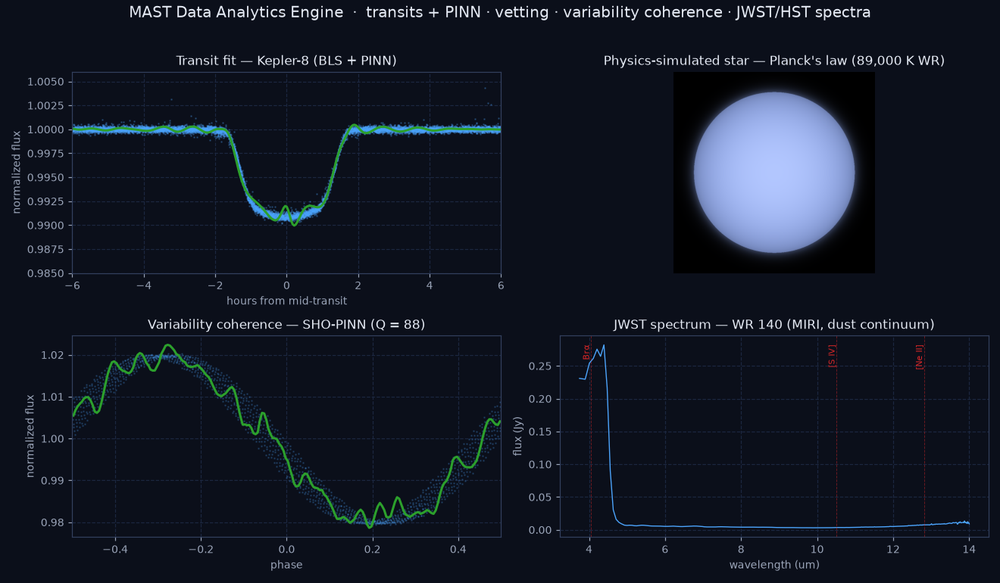

# MAST Data Analytics Engine

An end-to-end analytics engine for MAST data — Kepler / K2 / TESS time-series photometry, plus JWST / HST spectroscopy of Wolf-Rayet stars. It:

- **measures exoplanet sizes** — removes instrument drift, finds transits with Box Least Squares, and fits the planet-to-star radius ratio two ways (the classical BLS box and a Physics-Informed Neural Network);
- **vets false positives** — odd/even, secondary-eclipse, transit-SNR and centroid-motion tests assign each candidate a disposition (planet candidate / needs review / likely false positive);
- **characterises variable stars** — a second SHO-PINN measures the coherence (quality factor Q) of stellar variability, with a dedicated Wolf-Rayet mission;
- **displays JWST / HST spectra** — fetches and parses 1D spectra from MAST (JWST EXTRACT1D, HST STIS/GHRS) with Wolf-Rayet emission-line markers;
- **validates against the NASA Exoplanet Archive** and serves everything through an interactive Streamlit dashboard.

The repo ships with a populated results database (synthetic ground-truth targets + Kepler 8–17 + a TESS planet + real Wolf-Rayet stars) and bundled JWST/HST spectra, so the dashboard works the moment you launch it — no downloads. To analyse your own targets, run the pipeline against MAST. For the physics, validation numbers, and architecture, see [METHODOLOGY.md](METHODOLOGY.md).



## Run the dashboard (30 seconds, no downloads)

The dashboard reads the bundled database — it needs neither the internet nor PyTorch:

```bash
python -m venv .venv && .venv\Scripts\activate     # macOS/Linux: source .venv/bin/activate
pip install -r requirements.txt
streamlit run app.py
```

## Run the pipeline (measure your own targets)

Ingestion and PINN training need the heavier dependencies:

```bash
pip install -r requirements-pipeline.txt
python run_pipeline.py --synthetic --pinn                   # offline demo, known ground truth
python run_pipeline.py --targets Kepler-8 Kepler-10 --pinn  # real data from MAST
python run_pipeline.py --targets TOI-132 --mission TESS --pinn --vet   # + false-positive vetting
python run_pipeline.py --targets "HD 50896" --mission TESS --mode variability --pinn   # Wolf-Rayet coherence
python validate.py --range Kepler 8 17                      # compare vs NASA archive
```

Note: PyTorch requires Python ≤ 3.13 — on Windows use `py -3.12 -m venv .venv` if your default Python is newer. The dashboard itself has no such constraint.

## Deploy to Streamlit Community Cloud

**Hosted vs local.** The hosted dashboard is a **precomputed showcase** — it displays the bundled results (transits, PINN fits, vetting, variability, and JWST/HST spectra) but does **not** run the live pipeline: MAST ingestion, PINN training, and spectrum fetching need heavier dependencies (lightkurve, torch, astroquery) that aren't installed on the lightweight cloud build. To run the pipeline on your own targets, clone and install `requirements-pipeline.txt` locally (the "Analyze now" / "Fetch spectrum" buttons appear only there). The app detects this automatically and shows a banner on the hosted deploy.

The dashboard is deployment-ready — the bundled database and `data/` arrays ship in the repo, so a fresh deploy renders results on first visit with no pipeline run.

1. Push this repo to GitHub (the demo DB + `data/processed/*.npz` + `data/spectra/*.npz` are committed on purpose).
2. At [share.streamlit.io](https://share.streamlit.io), create an app pointing at this repo, branch, and `app.py`.
3. That's it — no secrets needed (MAST and the NASA archive are public). The cloud build installs only `requirements.txt` (Streamlit + pandas + numpy + matplotlib); the dashboard never imports torch or lightkurve.

Notes:
- Paths are environment-overridable (`KEPLER_DB`, `KEPLER_DATA_DIR`) if you want to point at a different bundled database.
- The in-dashboard "analyze" and "fetch spectrum" buttons need the pipeline dependencies (lightkurve/torch/astroquery) and so only appear locally, not on the lightweight cloud deploy — which serves the precomputed, bundled results.
